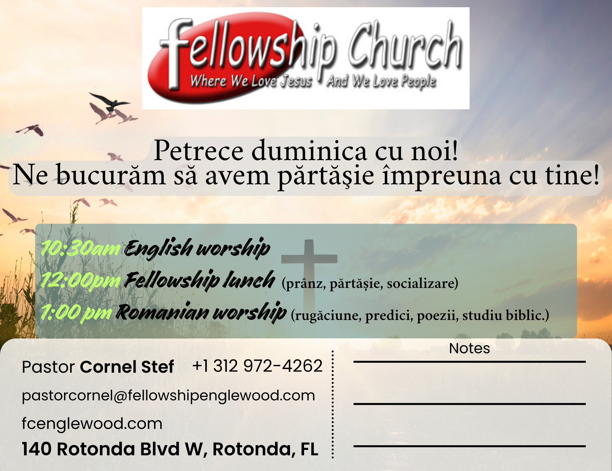

# Fellowship International Romanian Church - Website Documentation

## 🏛️ Church Information

**Church Name:** Fellowship International Romanian Church

**Location:** 140 Rotonda Blvd W, Rotonda West, FL 33947

**Tagline:** Where We Love Jesus And We Love People

**Romanian Header:** Petrece Duminică cu noi! *(Spend Sunday With Us!)*

**Mission:** To be a welcoming community where people of all backgrounds can experience the love of Jesus Christ, grow in faith, and serve others with compassion and dedication.

---

## 📝 Website Overview

This is a modern, responsive website for Fellowship International Romanian Church built with HTML5, CSS3, and vanilla JavaScript. The site features:
- Clean, simple design with red (#DC143C) and blue (#003366) color scheme
- Bilingual content (English & Romanian)
- Mobile-responsive layout
- **Interactive hero section with quick navigation buttons** (Invitation, About Us, Contact, Facebook)
- **Get Directions button** linking to Google Maps
- Facebook integration
- Image gallery
- Invitation flyer section
- Favicon using church logo

---

## ⏰ Service Schedule

| Time | Service | Language |
|------|---------|----------|
| **10:30 AM** | English Worship | English |
| **12:00 PM** | Fellowship Lunch | Community Meal |
| **1:00 PM** | Romanian Worship | Romanian (Slujbă în limba română) |

---

## 📞 Contact Information

| Item | Details |
|------|---------|
| **Pastor** | Cornel Stef |
| **Phone** | 312-972-4262 |
| **Email** | pastorcornel@fellowshipenglewood.com |
| **Address** | 140 Rotonda Blvd W, Rotonda West, FL 33947 |
| **Facebook** | [Visit Facebook](https://www.facebook.com/profile.php?id=61577056664026) |

---

## 🗂️ Project File Structure

```
fellowshipinternational/
├── index.html                                    # Main HTML (371 lines)
├── styles.css                                    # Complete CSS (1,102 lines)
├── script.js                                     # JavaScript (241 lines)
├── README.md                                     # This documentation
├── Notes.txt                                     # Development notes
├── .gitignore                                    # Git ignore file
└── assets/                                       # Images folder
    ├── fellowship church internaltional.jpg      # Church logo/branding
    └── Fellowshipinternationalflyer.png          # Invitation flyer
```

---

## 📋 HTML Structure & Characteristics

### Document Setup

```html
<!DOCTYPE html>
<html lang="en">
<head>
    <meta charset="UTF-8">
    <meta name="viewport" content="width=device-width, initial-scale=1.0">
    <title>Fellowship International Romanian Church | Rotonda West, FL</title>
```

**HTML Characteristics:**
- **DOCTYPE:** HTML5 (`<!DOCTYPE html>`)
- **Language:** English (`lang="en"`)
- **Character Encoding:** UTF-8 (universal character support)
- **Viewport:** Responsive design with device scaling
- **Title:** SEO-optimized and descriptive

**External Resources:**
- CSS: `styles.css` (main stylesheet)
- Icons: Font Awesome 6.5.1 CDN
- Fonts: Google Fonts (Cardo, Poppins)

---

## 🔨 HTML Sections & Components

### 1. Navigation Bar (`<nav class="navbar">`)

**Purpose:** Sticky header navigation for site-wide access

**HTML Structure:**
```html
<nav class="navbar">
    <div class="container">
        <div class="nav-brand">
            
        </div>
        <ul class="nav-menu">
            <li><a href="#home">Home</a></li>
            <li><a href="#invitation">Invitation</a></li>
            <li><a href="#about">About Us</a></li>
            <li><a href="#gallery">Gallery</a></li>
            <li><a href="#contact">Contact</a></li>
        </ul>
        <div class="hamburger">
            <span></span><span></span><span></span>
        </div>
    </div>
</nav>
```

**Key Features:**
- Fixed position (`sticky`) for persistent visibility
- Logo image display
- Responsive menu with anchor links
- Hamburger toggle for mobile devices
- Semantic `<nav>` element

**CSS Classes:**
- `.navbar` - Navigation container with sticky positioning
- `.nav-brand` - Logo section
- `.nav-menu` - Navigation list
- `.hamburger` - Mobile menu button (3 spans)
- `.nav-logo` - Logo image (height: 65px)

**Functionality:**
- Smooth scroll to sections using anchor links
- Mobile hamburger menu toggle via JavaScript
- Menu closes when link clicked

---

### 2. Hero Section (`<section id="home" class="hero">`)

**Purpose:** Welcome banner with church branding and message

**HTML Structure:**
```html
<section id="home" class="hero">
    <div class="hero-content">
        
        <h1 class="hero-title">Petrece Duminică cu noi!</h1>
        <p class="hero-subtitle">Spend Sunday With Us!</p>
        <p class="hero-text">Ne bucurăm să avem părtășie împreună cu tine!</p>
        <p class="hero-text-en">We're happy to have fellowship with you!</p>
        <h2 class="church-name">Fellowship International Romanian Church</h2>
        <p class="tagline">Where We Love Jesus And We Love People</p>
        
        <a href="https://maps.google.com/?q=140+Rotonda+Blvd+W,+Rotonda+West,+FL+33947" 
           target="_blank" class="directions-button">
            <i class="fas fa-map-marker-alt"></i>
            Get Directions
        </a>
        
        <div class="hero-buttons">
            <a href="#invitation" class="hero-button invitation-btn">
                <i class="fas fa-envelope"></i>
                Invitation
            </a>
            <a href="#about" class="hero-button about-btn">
                <i class="fas fa-info-circle"></i>
                About Us
            </a>
            <a href="#contact" class="hero-button contact-btn">
                <i class="fas fa-phone"></i>
                Contact
            </a>
            <a href="#events" class="hero-button events-btn">
                <i class="fab fa-facebook-f"></i>
                Facebook
            </a>
        </div>
    </div>
    <div class="hero-background"></div>
</section>
```

**Semantic HTML Elements:**
- `<h1>` - Primary heading (Romanian greeting)
- `<h2>` - Secondary heading (church name)
- `<p>` - Paragraphs for text content
- `<section>` - Semantic section container
- `` - Church logo with alt text
- `<a>` - Links for buttons

**Content:**
- Church logo image (height: 200px)
- Main heading in Romanian: "Petrece Duminică cu noi!" (Spend Sunday with us!)
- English translation: "Spend Sunday With Us!"
- Romanian welcome: "Ne bucurăm să avem părtășie împreună cu tine!"
- English translation: "We're happy to have fellowship with you!"
- Church name in full
- Tagline: "Where We Love Jesus And We Love People"

**Action Buttons:**

1. **Get Directions Button** (`.directions-button`)
   - Icon: Map marker (`fas fa-map-marker-alt`)
   - Links to Google Maps with church address
   - Opens in new tab (`target="_blank"`)
   - White background with blue text
   - Hovers to red background

2. **Navigation Buttons** (`.hero-buttons` container with 4 buttons)

   | Button | Icon | Link | Color |
   |--------|------|------|-------|
   | **Invitation** | `fas fa-envelope` | #invitation | Red background |
   | **About Us** | `fas fa-info-circle` | #about | Semi-transparent white |
   | **Contact** | `fas fa-phone` | #contact | Semi-transparent white |
   | **Facebook** | `fab fa-facebook-f` | #events | Semi-transparent white |

   - All buttons use smooth scroll anchors
   - Hover effects with color transitions
   - Icons included with each button
   - Responsive layout (flexbox, stacks on mobile)

**Background Features:**
- `.hero-background` - Gradient background (blue to red)
- Animated dot pattern overlay (CSS animation: `moveBackground`)
- Full-width display (min-height: 600px)

**CSS Styling:**
- Gradient: Blue (#003366) → Red (#DC143C)
- Centered content with flexbox
- Fade-in animation on page load
- Text shadow for readability
- Button spacing: `.directions-button` above, `.hero-buttons` below with flex gap
- Responsive button sizing for mobile devices

**CSS Classes:**
- `.hero` - Main section container
- `.hero-content` - Centered content wrapper
- `.hero-logo` - Logo image (200px height)
- `.hero-title` - Main heading styling
- `.hero-subtitle` - Subtitle styling
- `.church-name` - Church name heading
- `.tagline` - Tagline paragraph
- `.directions-button` - Get Directions button styling
- `.hero-buttons` - Button container (flexbox)
- `.hero-button` - Individual button base styling
- `.invitation-btn` - Red background button
- `.about-btn` - Semi-transparent white button
- `.contact-btn` - Semi-transparent white button
- `.events-btn` - Facebook blue hover button

**Interactive Features:**
- Smooth scroll to sections using anchor links
- Hover effects on all buttons with transform and shadow
- Color transitions on hover
- Touch-friendly button sizing (14px+ padding)
- Mobile responsive with stacked layout on small screens

---

### 3. Services Section (`<section id="services" class="services">`)

**Purpose:** Display service times and worship options

**HTML Structure:**
```html
<section id="services" class="services">
    <div class="container">
        <h2 class="section-title">Our Services</h2>
        <p class="section-subtitle">Join us for worship and fellowship</p>
        
        <div class="services-grid">
            <div class="service-card">
                <div class="service-icon">
                    <i class="fas fa-book-open"></i>
                </div>
                <h3>10:30 AM</h3>
                <p>English Worship</p>
                <span class="service-details">Experience contemporary worship in English</span>
            </div>
            <!-- 2 more service cards -->
        </div>
    </div>
</section>
```

**Service Cards (3 total):**

1. **10:30 AM English Worship**
   - Icon: `fas fa-book-open` (book icon)
   - Text: "Experience contemporary worship in English"

2. **12:00 PM Fellowship Lunch**
   - Icon: `fas fa-users` (people icon)
   - Text: "Share a meal and build community"

3. **1:00 PM Romanian Worship**
   - Icon: `fas fa-church` (church icon)
   - Text: "Slujbă în limba română cu adorație tradițională" (Romanian service description)

**HTML Elements Used:**
- `<section>` - Container
- `<h2>` - Section title
- `<p>` - Subtitle and descriptions
- `<div>` - Grid wrapper and cards
- `<i>` - Font Awesome icons
- `<span>` - Service details

**CSS Classes:**
- `.services-grid` - CSS Grid (auto-fit minmax(300px))
- `.service-card` - Individual card styling
- `.service-icon` - Icon color and sizing
- `.service-details` - Description styling

---

### 4. Invitation Flyer Section (`<section id="invitation" class="invitation">`)

**Purpose:** Showcase invitation flyer and service times in an engaging format

**HTML Structure:**
```html
<section id="invitation" class="invitation">
    <div class="container">
        <h2 class="section-title">You Are Invited!</h2>
        <p class="section-subtitle">Join our welcoming community</p>
        
        <div class="flyer-container">
            <div class="flyer-image">
                
            </div>
            <div class="flyer-info">
                <h3>Join Us This Sunday</h3>
                <p>We would love to see you at Fellowship International Romanian Church...</p>
                
                <div class="service-times">
                    <div class="time-slot">
                        <span class="time-icon">🕦</span>
                        <div>
                            <h4>10:30 AM</h4>
                            <p>English Worship</p>
                        </div>
                    </div>
                    <div class="time-slot">
                        <span class="time-icon">🍽️</span>
                        <div>
                            <h4>12:00 PM</h4>
                            <p>Fellowship Lunch</p>
                        </div>
                    </div>
                    <div class="time-slot">
                        <span class="time-icon">✝️</span>
                        <div>
                            <h4>1:00 PM</h4>
                            <p>Romanian Worship</p>
                        </div>
                    </div>
                </div>
            </div>
        </div>
    </div>
</section>
```

**Key Features:**
- Prominent flyer image display
- Two-column layout (image + info)
- Service times with emoji icons
- Welcoming message text
- Responsive to mobile (single column)

**HTML Structure:**
- `<section>` - Main container
- `<h2>`, `<h3>` - Headings
- `` - Flyer image with alt text
- `<div>` - Layout containers
- `<h4>`, `<p>` - Service details
- `<span>` - Emoji icons

**CSS Classes:**
- `.invitation` - Section background
- `.flyer-container` - Two-column grid
- `.flyer-image` - Image column with hover effects
- `.flyer-info` - Information column
- `.service-times` - Time slots container
- `.time-slot` - Individual time slot card

---

### 5. Events & Facebook Section (`<section id="events" class="events">`)

**Purpose:** Drive Facebook engagement and social community

**HTML Structure:**
```html
<section id="events" class="events">
    <div class="container">
        <h2 class="section-title">Stay Connected</h2>
        <p class="section-subtitle">
            Follow us on Facebook for the latest events and announcements
        </p>
        
        <div class="facebook-container">
            <div class="facebook-box">
                <div class="facebook-icon-large">
                    <i class="fab fa-facebook-f"></i>
                </div>
                <h3>Join Our Community Online</h3>
                <p>Visit our Facebook page to see upcoming events...</p>
                <a href="https://www.facebook.com/profile.php?id=61577056664026" 
                   target="_blank" 
                   class="facebook-link">
                    <i class="fab fa-facebook-f"></i>
                    <span>Follow Us On Facebook</span>
                </a>
            </div>
        </div>
    </div>
</section>
```

**Key Features:**
- Blue gradient background (`--primary-blue` to lighter blue)
- Large Facebook icon display
- Call-to-action button
- Link opens Facebook in new tab (`target="_blank"`)
- Responsive container with hover effects

**HTML Elements:**
- `<section>` - Blue gradient section
- `<h2>`, `<h3>` - Headings
- `<p>` - Description text
- `<a>` - Facebook link with `target="_blank"`
- `<i>` - Facebook icons (Font Awesome: `fab fa-facebook-f`)
- `<span>` - Link text

**CSS Classes:**
- `.events` - Blue gradient section with pattern overlay
- `.facebook-container` - Centered container
- `.facebook-box` - Card styling with border-top
- `.facebook-icon-large` - Large icon (4rem size)
- `.facebook-link` - Button styling with hover effects

**Link Details:**
- URL: `https://www.facebook.com/profile.php?id=61577056664026`
- Opens in new tab for better UX
- Button has hover animation (translate, shadow)

---

### 6. Gallery Section (`<section id="gallery" class="gallery">`)

**Purpose:** Showcase community moments and activities

**HTML Structure:**
```html
<section id="gallery" class="gallery">
    <div class="container">
        <h2 class="section-title">Our Community</h2>
        <p class="section-subtitle">Moments of faith, worship, and fellowship</p>
        
        <div class="gallery-grid">
            <div class="gallery-item">
                <div class="gallery-placeholder">
                    <i class="fas fa-church"></i>
                    <p>Sunday Worship</p>
                </div>
            </div>
            <!-- 5 more items -->
        </div>
    </div>
</section>
```

**Gallery Items (6 total):**

| Icon | Label | Font Awesome Class |
|------|-------|-------------------|
| ⛪ | Sunday Worship | `fas fa-church` |
| 🙏 | Prayer & Praise | `fas fa-hands-praying` |
| 👥 | Fellowship Community | `fas fa-users` |
| ❤️ | Service & Love | `fas fa-heart` |
| 👶 | Family Ministry | `fas fa-child` |
| 📅 | Special Events | `fas fa-calendar-alt` |

**HTML Structure:**
```html
<div class="gallery-item">
    <div class="gallery-placeholder">
        <i class="fas fa-church"></i>
        <p>Sunday Worship</p>
    </div>
</div>
```

**Styling Features:**
- CSS Grid layout (`auto-fit minmax(250px, 1fr)`)
- Square aspect ratio (1:1)
- Gradient backgrounds (blue to red on hover)
- Scale animation on hover (1.05x)
- Smooth transitions

**CSS Classes:**
- `.gallery-grid` - CSS Grid container
- `.gallery-item` - Grid item with overflow hidden
- `.gallery-placeholder` - Content container with gradient

**Responsive:**
- Desktop: 3+ columns
- Tablet: 2 columns
- Mobile: 1 column

---

### 7. About Us Section (`<section id="about" class="about">`)

**Purpose:** Share church mission, vision, and story

**HTML Structure:**
```html
<section id="about" class="about">
    <div class="container">
        <h2 class="section-title">About Our Church</h2>
        <p class="section-subtitle">Building a Community of Faith</p>
        
        <div class="about-content">
            <div class="about-column">
                <h3>Our Mission</h3>
                <p>To be a welcoming community where people of all backgrounds...</p>
            </div>
            <div class="about-column">
                <h3>Our Vision</h3>
                <p>To create a vibrant fellowship where English and Romanian speakers...</p>
            </div>
            <div class="about-column">
                <h3>Our Beliefs</h3>
                <p>We believe in the power of God's Word, the importance of worship...</p>
            </div>
        </div>
        
        <div class="about-history">
            <h3>Our Story</h3>
            <p>Fellowship International Romanian Church was founded to serve the...</p>
        </div>
    </div>
</section>
```

**Three-Column Content:**
1. **Our Mission** - Community welcome and faith growth
2. **Our Vision** - Bilingual fellowship and cultural bridge
3. **Our Beliefs** - Theological foundation and values

**Story Section:**
- Full-width after three columns
- Blue gradient background
- White text
- Centered alignment

**HTML Elements:**
- `<section>` - About container
- `<h2>`, `<h3>` - Headings (h3 used for columns)
- `<p>` - Content paragraphs
- `<div>` - Layout containers

**CSS Classes:**
- `.about` - Section container
- `.about-content` - Three-column grid (`repeat(auto-fit, minmax(280px, 1fr))`)
- `.about-column` - Individual column with red left-border
- `.about-history` - Story section with blue gradient, white text

**Responsive:**
- Desktop: 3 columns for top section
- Mobile: 1 column

---

### 8. Contact Section (`<section id="contact" class="contact">`)

**Purpose:** Provide church contact information, map, and social links

**HTML Structure:**
```html
<section id="contact" class="contact">
    <div class="container">
        <h2 class="section-title">Get In Touch</h2>
        
        <div class="contact-content">
            <div class="contact-info">
                <h3>Fellowship International Romanian Church</h3>
                
                <div class="contact-item">
                    <div class="contact-icon">
                        <i class="fas fa-map-marker-alt"></i>
                    </div>
                    <div class="contact-details">
                        <h4>Address</h4>
                        <p>140 Rotonda Blvd W<br>Rotonda West, FL 33947</p>
                    </div>
                </div>
                
                <div class="contact-item">
                    <div class="contact-icon">
                        <i class="fas fa-user-clergy"></i>
                    </div>
                    <div class="contact-details">
                        <h4>Pastor</h4>
                        <p>Cornel Stef</p>
                    </div>
                </div>
                
                <div class="contact-item">
                    <div class="contact-icon">
                        <i class="fas fa-phone"></i>
                    </div>
                    <div class="contact-details">
                        <h4>Phone</h4>
                        <a href="tel:312-972-4262">312-972-4262</a>
                    </div>
                </div>
                
                <div class="contact-item">
                    <div class="contact-icon">
                        <i class="fas fa-envelope"></i>
                    </div>
                    <div class="contact-details">
                        <h4>Email</h4>
                        <a href="mailto:pastorcornel@fellowshipenglewood.com">
                            pastorcornel@fellowshipenglewood.com
                        </a>
                    </div>
                </div>
                
                <div class="contact-item">
                    <div class="contact-icon">
                        <i class="fab fa-facebook"></i>
                    </div>
                    <div class="contact-details">
                        <h4>Facebook</h4>
                        <a href="https://www.facebook.com/profile.php?id=61577056664026" 
                           target="_blank">
                            Follow Us On Facebook
                        </a>
                    </div>
                </div>
                
                <div class="social-links">
                    <a href="https://www.facebook.com/profile.php?id=61577056664026" 
                       target="_blank" class="social-icon facebook">
                        <i class="fab fa-facebook-f"></i>
                    </a>
                </div>
            </div>
            
            <div class="map-container">
                <iframe src="https://www.google.com/maps/embed?pb=..." 
                        width="100%" height="400" style="border:0;" 
                        allowfullscreen="" loading="lazy">
                </iframe>
            </div>
        </div>
    </div>
</section>
```

**Contact Items (5 total):**

| Icon | Type | Content |
|------|------|---------|
| `fas fa-map-marker-alt` | Address | 140 Rotonda Blvd W, Rotonda West, FL 33947 |
| `fas fa-user-clergy` | Pastor | Cornel Stef |
| `fas fa-phone` | Phone | `tel:312-972-4262` (clickable) |
| `fas fa-envelope` | Email | `mailto:pastorcornel@fellowshipenglewood.com` (clickable) |
| `fab fa-facebook` | Facebook | Link to Facebook page |

**Key Features:**
- Two-column layout (info + map)
- Clickable phone number (`tel:` protocol)
- Clickable email (`mailto:` protocol)
- Google Maps embed
- Social media icons
- Blue gradient background

**HTML Elements:**
- `<div>` - Contact item containers
- `<h3>`, `<h4>` - Headings
- `<p>` - Static text
- `<a>` - Clickable links with protocols
- `<i>` - Font Awesome icons
- `<iframe>` - Google Maps embed

**CSS Classes:**
- `.contact` - Section with blue gradient
- `.contact-content` - Two-column grid
- `.contact-info` - Information column
- `.contact-item` - Individual item with flex layout
- `.contact-icon` - Icon styling (red color)
- `.contact-details` - Text content
- `.map-container` - Maps iframe wrapper
- `.social-links` - Social icons container
- `.social-icon` - Individual social button

**Google Maps:**
- Embedded iframe with address
- Responsive width (100%)
- Height: 400px (adjusts for mobile)
- `loading="lazy"` for performance

---

### 9. Footer (`<footer class="footer">`)

**Purpose:** Site-wide footer with links, hours, and copyright

**HTML Structure:**
```html
<footer class="footer">
    <div class="container">
        <div class="footer-content">
            <div class="footer-section">
                
                <h4>Fellowship International Romanian Church</h4>
                <p>Bringing faith, hope, and community together</p>
            </div>
            
            <div class="footer-section">
                <h4>Quick Links</h4>
                <ul>
                    <li><a href="#home">Home</a></li>
                    <li><a href="#invitation">Invitation</a></li>
                    <li><a href="#about">About Us</a></li>
                    <li><a href="#gallery">Gallery</a></li>
                    <li><a href="#contact">Contact</a></li>
                </ul>
            </div>
            
            <div class="footer-section">
                <h4>Service Hours</h4>
                <p>Sundays<br>10:30 AM - 2:00 PM</p>
            </div>
        </div>
        
        <div class="footer-bottom">
            <p>&copy; 2026 Fellowship International Romanian Church. All rights reserved.</p>
            <p>140 Rotonda Blvd W, Rotonda West, FL 33947</p>
        </div>
    </div>
</footer>
```

**Footer Sections (3 columns):**

1. **Logo Section**
   - Church logo image
   - Name heading
   - Mission statement

2. **Quick Links**
   - Home
   - Invitation
   - About Us
   - Gallery
   - Contact

3. **Service Hours**
   - Sundays
   - 10:30 AM - 2:00 PM

**Bottom Section:**
- Copyright notice (© 2026)
- Address information

**HTML Elements:**
- `<footer>` - Semantic footer element
- `<div>` - Layout containers
- `<h4>` - Section headings
- `<p>` - Text content
- `<ul>`, `<li>` - List items
- `<a>` - Anchor links
- `<br>` - Line breaks
- `` - Logo image

**CSS Classes:**
- `.footer` - Dark background container
- `.footer-content` - Three-column grid
- `.footer-section` - Individual column
- `.footer-logo` - Logo styling
- `.footer-bottom` - Bottom border section

**Styling:**
- Dark background (`var(--dark-text)`)
- Red accent headings
- White text with opacity for secondary
- Grid layout: 3 columns → 1 column on mobile

---

## 🎨 CSS Characteristics

### Color System
```css
:root {
    --primary-red: #DC143C;           /* Accent & highlights */
    --primary-blue: #003366;          /* Main headings */
    --light-blue: #1E5A96;            /* Secondary elements */
    --white: #F3F5F9;                 /* Primary background */
    --dark-text: #2C3E50;             /* Body text */
    --shadow: 0 4px 6px rgba(0, 0, 0, 0.1);
    --shadow-lg: 0 10px 25px rgba(0, 0, 0, 0.1);
}
```

### Typography
```css
body {
    font-family: 'Poppins', sans-serif;        /* Body text */
    line-height: 1.6;                         /* Readability */
}

h1, h2, h3, h4 {
    font-family: 'Cardo', serif;               /* Headings */
    font-weight: 700;
}
```

### Layouts
- **CSS Grid** - Section layouts, gallery, footer
- **Flexbox** - Navigation, cards, items
- **Responsive** - Media queries at 768px and 480px

### Animations
- **Fade-in** - Hero section content
- **Scale** - Gallery items on hover
- **Translate** - Cards on hover
- **Background move** - Hero pattern animation

---

## 🔧 Technologies & Libraries

### Built With
- **HTML5** - Semantic markup
- **CSS3** - Modern styling with Grid/Flexbox
- **JavaScript (Vanilla)** - No frameworks needed
- **Font Awesome 6.5.1** - Icons via CDN
- **Google Fonts** - Cardo & Poppins
- **Google Maps API** - Embedded location

### JavaScript Functionality
- Mobile menu toggle
- Scroll animations
- Smooth scrolling
- Intersection Observer for performance

---

## 📱 Responsive Design

| Screen | Width | Layout |
|--------|-------|--------|
| Desktop | 1200px+ | Full layouts |
| Tablet | 769-1199px | Adjusted spacing |
| Mobile | 481-768px | Hamburger menu |
| Small | <480px | Minimal spacing |

---

## 🚀 How to Use

### Run Locally
```bash
# Python
python3 -m http.server 8000

# PHP
php -S localhost:8000
```

Then open: `http://localhost:8000`

### Customize Content
Edit `index.html` to change:
- Pastor name
- Phone number
- Email address
- Service times
- Facebook link

### Change Colors
Edit CSS variables in `styles.css` (lines ~10):
```css
--primary-red: #DC143C;
--primary-blue: #003366;
```

---

## ✅ Quality Checklist

- ✅ Bilingual content (English & Romanian)
- ✅ Accessible HTML structure
- ✅ Responsive all devices
- ✅ Modern design
- ✅ Facebook integration
- ✅ Contact information
- ✅ Service schedule
- ✅ Gallery section
- ✅ Invitation flyer
- ✅ Mobile menu
- ✅ SEO-friendly

---

**Website Version:** 1.0  
**Last Updated:** February 23, 2026  
**Created for:** Fellowship International Romanian Church
